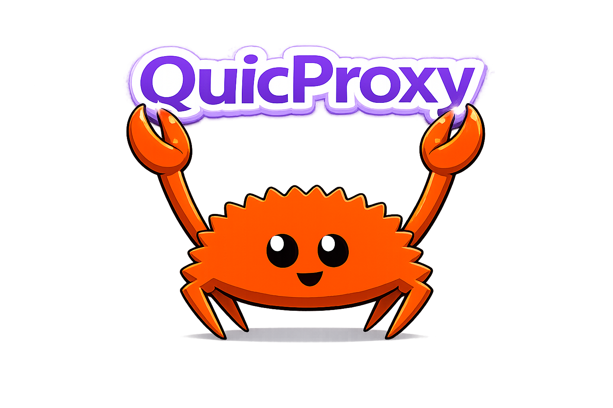

<div align="center">
    
  <br>
  <sup>高性能、低内存、零延迟、安全且简单易用的开源游戏加速器</sup>
</div>

# 直接点击下载

|      平台      | 下载                                                                                                                | 说明                                                       |
| :------------: | ------------------------------------------------------------------------------------------------------------------- | ---------------------------------------------------------- |
| 🖥️ **Windows** | [⬇ 下载安装包](https://github.com/RealBikiniBottom/QuicProxy/releases/latest/download/QuicProxy-Windows-Setup.exe) | `.exe` 安装程序                                            |
| 📱 **Android** | [⬇ 下载 APK](https://github.com/RealBikiniBottom/QuicProxy/releases/latest/download/QuicProxy-Android.apk)         | `.apk` APP                                                 |
|  🐧 **Linux**  | [安装教程](./doc/linux.md) 和 [搭建节点](#三步搭建属于自己的节点)                                                   | 有无 gui 的 Linux 都可以用                                 |
| 🛜 **软路由**  | 参考[安装教程](./doc/linux.md)                                                                                      | 包含 [Web 面板](https://github.com/spongebob888/quicboard) |
|  🍎 **macOS**  | _即将发布_                                                                                                          |                                                            |
|   📱 **iOS**   | _即将发布_                                                                                                          |                                                            |

## 简单易用(Out of the box)

得益于 JLS，不需要购买域名、不需要自己生成证书；开箱即用，小白友好，不需要任何配置东西：

- 下载
- 安装
- 导入订阅
- 启动

只有 4 步直接使用我们推荐的最佳实践：

- 精确的国内国外分流
- 不泄露 DNS 查询
- 自动选择最佳节点

## 三步搭建属于自己的节点

在 Linux 服务器上运行以下命令，一键安装：

```bash
curl -fsSL https://raw.githubusercontent.com/RealBikiniBottom/QuicProxy/master/linux_install.sh | sudo bash
```

脚本会自动完成，输出订阅链接，导入客户端即可使用。

## 支持的协议

入站：

- Socks5
- HTTP
- Tun
- Shadowquic
- AnyTLS
- AnyTLS-JLS
- Trojan

出站：

- Shadowquic （推荐）
- Socks5
- AnyTLS
- AnyTLS-JLS
- Trojan
- Shadowsocks
- Vmess

## 全程零延迟

对于一条需要代理的 TCP 链接：

- 其他 TCP 方案（例如说 Trojan）：需要先建立 TCP （三次握手，消耗 1.5 RTT），然后建立 TLS （消耗 1 RTT）。

- 其他 QUIC 方案（例如说 Hysteria2）：使用已经建立的 Connection 发送 Stream 请求 （无需 RTT），若 Connection 中断则需要 1 RTT 去恢复。

- 我们的方案：使用 QUIC Connection Early Data，即使是断开了 Connection，依然不需要任何 RTT 就能恢复正常传输。

**弱网高可用**，尤其合适网络经常变化的地方，比如说在高铁上信号基站经常切换，Shadowquic 丝滑切换，用户感受不到切换重连的卡顿

<!-- ## 先进的拥塞算法 -->

<!-- 使用 BBRv3，更快的启动延迟、稳定的发送窗口、在移动端（信号强弱经常变化）的表现更加亮眼！ -->

## UDP 友好

Full Cone，使用 UDP Extension，完美解决代理 QUIC 速度慢等历史遗留问题，加密且链接传输 UDP，对游戏更加友好。

## 低内存

只专注一件事，把他做到极致(Do one thing and do it well)，去掉莫名其妙的功能，回归本质。从头开始编写代码，精心调校，在性能、内存、能耗、安全性、易用性中不断 Tradeoff。

即使是开启了 tun，在日常重度使用中，内存几乎没有超过 20MB，积极保持低于苹果要求的 50MB 的限制。

## 机场主友好

使用开放友好的 MIT 开源协议，随意修改且随意闭源，想干啥就干啥。

免费提供后端 API 控制用户，见 [API](https://github.com/spongebob888/shadowquic/blob/main/document/api.md)，支持删除或添加用户，并获取流量情况。

我们保证：所有项目都不会出现机场、VPN、VPS、IP 代理等将自己客户引流到其他竞争对手的广告。

## 捐助

[Github Issue](https://github.com/RealBikiniBottom/QuicProxy/issues) 仅接受 Bug 报告且必须包含详细的复现步骤，如果你不确定是否为 Bug、有好的意见、使用问题等，请移步到 [讨论区](https://github.com/RealBikiniBottom/QuicProxy/discussions)。

QuicProxy 是一个完全免费的软件，出现任何问题都不承担任何责任；节点、订阅并不由 QuicProxy 提供。

为了维持健康发展，我们接受自愿捐款，付费用户会被开发者重视、可以加入小团体群聊、想要什么功能直接跟开发者谈。
